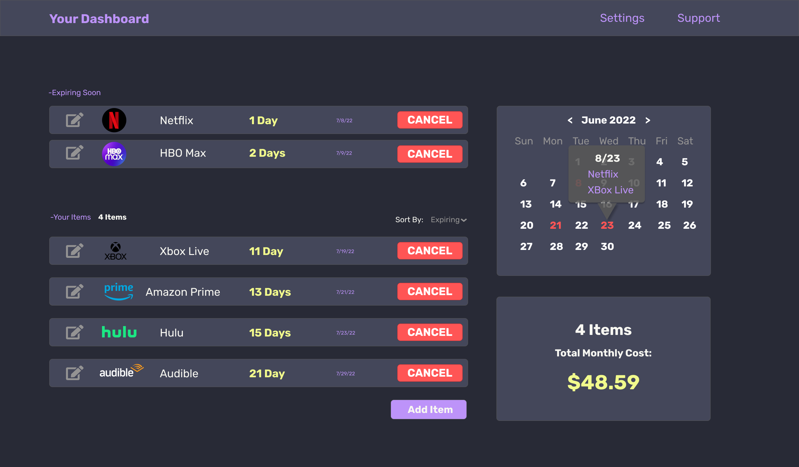

# When To Cancel Reminder 




## About 

This is an application that will keep track of your subscriptions to different services, such as Netflix, Amazon Prime, Hulu, etc.
It can let you know when you need to cancel before you are charged again.

## Tech Used

It is created with Next.js. It is still a work in progress but
the plan is to use Firebase as the backend. Zustand will be used
for state management. All the CSS is custom and is based on the
Dracula color scheme.

---

This is a [Next.js](https://nextjs.org/) project bootstrapped with [`create-next-app`](https://github.com/vercel/next.js/tree/canary/packages/create-next-app).

## Getting Started

First, run the development server:

```bash
npm run dev
# or
yarn dev
```

